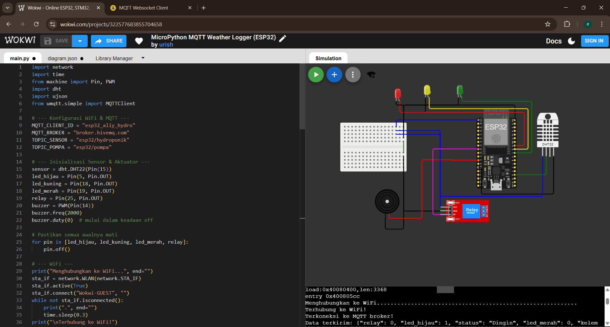
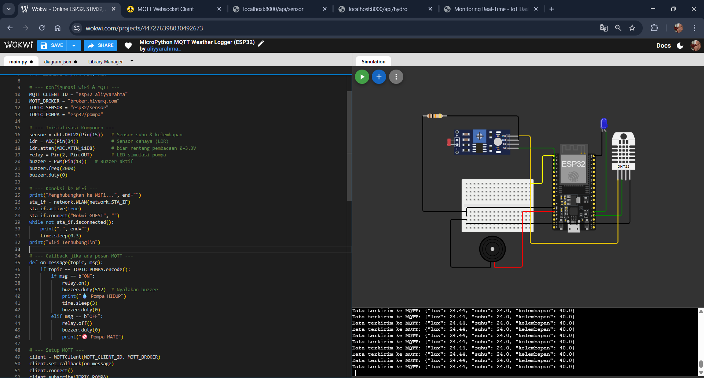
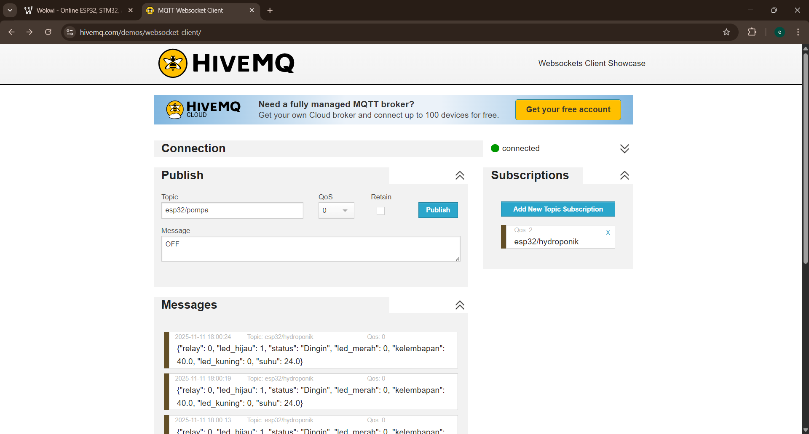
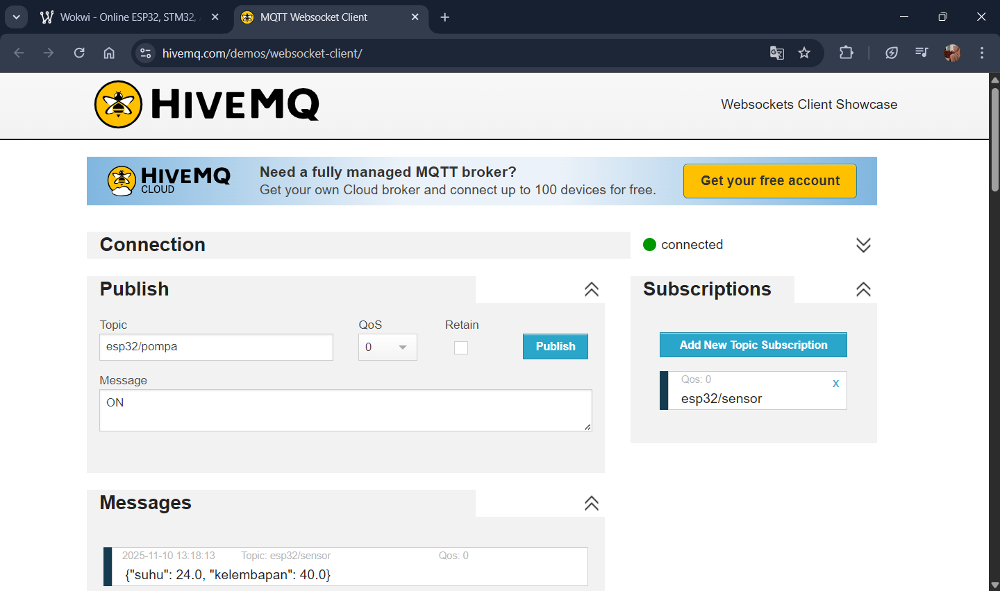
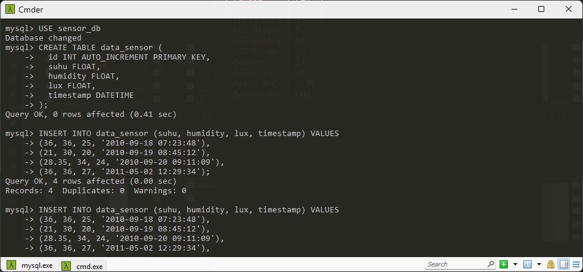
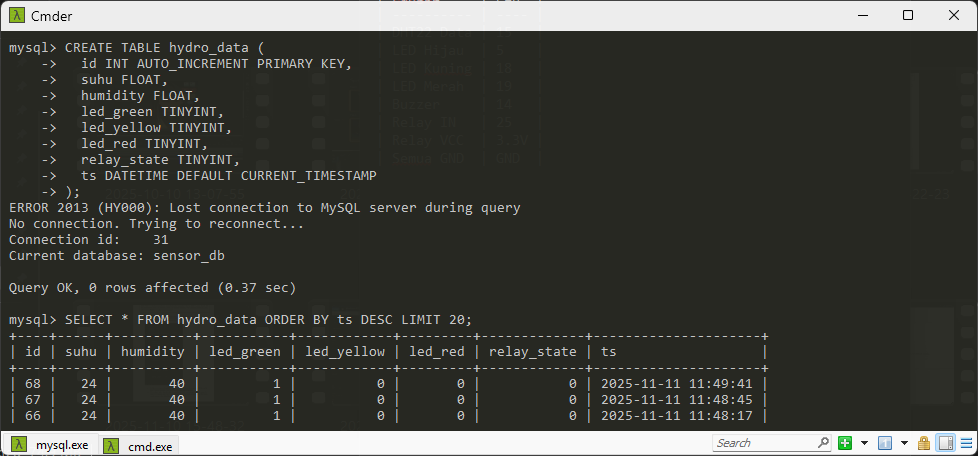
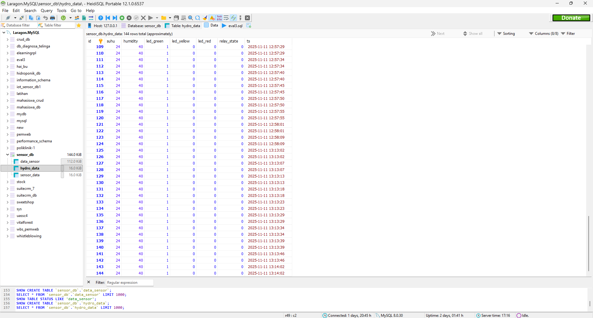
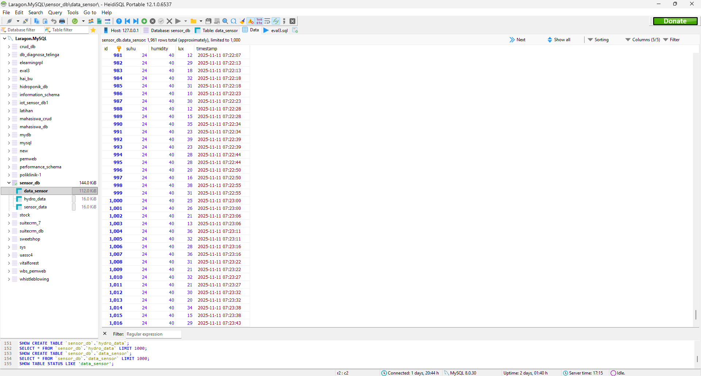
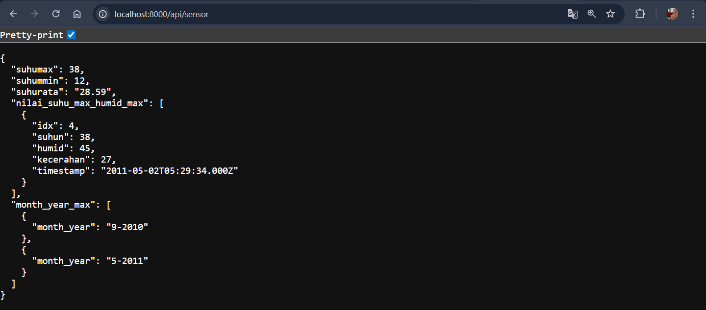

# 🌿 UTS Pemrograman IoT 2025/2026

**Institut Teknologi Nasional Bandung**
**Mata Kuliah:** IFB309 – Pemrograman IoT
**Nama:** Aliyya Rahmawati Putri
**NIM:** 152023093
**Kelas:** DD
**Dosen:** Galih Ashari R., S.Si., MT
📅 **Tanggal:** 11 November 2025

---

## 🧩 SOAL NOMOR 1
### Rancang Bangun Alat Hidroponik Berbasis Internet of Things

### a) Konsep Perpindahan Data

Sistem ini menggunakan konsep **IoT berbasis MQTT (Message Queuing Telemetry Transport)** dengan alur sebagai berikut:

* Sensor DHT22 membaca suhu & kelembapan.
* Data dikirim dalam format JSON ke topic MQTT (`esp32/hydroponik`).
* Backend menerima data via MQTT dan menyimpannya ke MySQL (`hydro_data`).
* Frontend menampilkan hasil pembacaan sensor serta tombol kontrol pompa.

---

### b) Kode Mikrokontroler (ESP32)

File: [`setting/konfigurasi_wokwi_1.py`](setting/konfigurasi_wokwi_1.py)

Kode ini mengatur LED dan pompa berdasarkan suhu:

* > 35°C → LED merah & buzzer aktif, pompa ON
* 30–35°C → LED kuning aktif
* < 30°C → LED hijau aktif

📸 **Wiring Diagram:**



📘 **Tabel Pin ESP32:**

| Komponen     | Pin |
| ------------ | --- |
| Sensor DHT22 | 15  |
| LED Hijau    | 5   |
| LED Kuning   | 18  |
| LED Merah    | 19  |
| Relay Pompa  | 25  |
| Buzzer       | 14  |

---

📡 **HiveMQ MQTT Setup:**



---

## 🧩 SOAL NOMOR 2

### Backend Data Sensor + MQTT Streaming

Backend ini digunakan untuk:

1. Menyimpan data suhu, kelembapan, dan lux dari ESP32.
2. Menghasilkan output JSON sesuai struktur soal.
3. Mengatur komunikasi MQTT dua arah antara backend dan ESP32.

---

### a) Backend Node.js

#### 📁 Struktur Folder

```
backend/
├── db.js
├── index.js
└── mqttClient.js
```

#### 🔹 db.js

```js
import mysql from "mysql2/promise";

const db = await mysql.createConnection({
  host: "localhost",
  user: "root",
  password: "",
  database: "sensor_db"
});

export default db;
```

#### 🔹 index.js (Express API)

* Menyediakan endpoint:

  * `/api/sensor`
  * `/api/all-sensor`
  * `/api/hydro`
  * `/api/hydro/control`

```js
app.get("/api/sensor", async (req, res) => {
  // Ambil data dari MySQL
  const [rows] = await db.execute("SELECT * FROM data_sensor");
  // Hitung suhu max/min/rata2
  ...
  res.json({ suhumax, suhummin, suhurata, ... });
});
```

#### 🔹 mqttClient.js

Menghubungkan backend ke **HiveMQ**, dan otomatis menyimpan data dari ESP32 ke database:

```js
client.on("message", async (topic, message) => {
  const data = JSON.parse(message.toString());
  if (topic === "esp32/sensor") {
     await db.execute("INSERT INTO data_sensor (suhu, humidity, lux, timestamp) VALUES (?, ?, ?, ?)", [...]);
  } else if (topic === "esp32/hydroponik") {
     await db.execute("INSERT INTO hydro_data (suhu, humidity, led_green, led_yellow, led_red, relay_state) VALUES (?, ?, ?, ?, ?, ?)", [...]);
  }
});
```

---

### b) ESP32 MQTT Streaming (Wokwi)

File: [`setting/konfigurasi_wokwi_2.py`](setting/konfigurasi_wokwi_2.py)

ESP32 membaca suhu, kelembapan, dan intensitas cahaya, lalu publish JSON ke broker MQTT:

```json
{
  "suhu": 28.5,
  "kelembapan": 60.2,
  "lux": 75.1
}
```

---

## 🗃️ Database MySQL

### 🔹 Create Table




### 🔹 Isi Tabel `data_sensor`



### 🔹 Isi Tabel `hydro_data`



---

## 🧭 Flowchart Sistem


---

## 🧪 Hasil Pengujian

* ESP32 berhasil publish data ke broker HiveMQ.
* Backend menerima data MQTT dan menyimpannya ke database.
* API `/api/all-sensor` menampilkan hasil data JSON yang siap digunakan di frontend.

📸 **Contoh hasil JSON:**


---

## 💡 Kesimpulan

✅ Sistem IoT berjalan dua arah — pengiriman data dan kontrol pompa.
✅ Backend otomatis menyimpan data MQTT ke MySQL dan menyediakan endpoint JSON.
✅ ESP32 mampu mengontrol pompa berdasarkan kondisi suhu real-time.
✅ Data dapat diakses melalui browser dan diproses di aplikasi frontend.

---

## 🚀 Cara Menjalankan Proyek

### 📍 1. Jalankan Backend

```bash
cd backend
npm install
node index.js
```

### 📍 2. Jalankan Frontend (Monitoring)

```bash
cd frontend
npm install
npm start
```

### 📍 3. Uji MQTT (Wokwi)

* Jalankan simulasi di Wokwi dengan kode `konfigurasi_wokwi_1.py` dan `konfigurasi_wokwi_2.py`
* Pastikan topik MQTT sama seperti di backend:

  ```
  esp32/sensor
  esp32/hydroponik
  esp32/pompa
  ```

---

## 📎 Dokumentasi Lengkap

| Jenis                             | Bukti                                                                                    |
| --------------------------------- | ---------------------------------------------------------------------------------------- |
| 💻 Repository GitHub              | [uts_pem_iot](https://github.com/aliyyarahma20/uts_pem_iot.git)                          |
| 🧩 Kode ESP32 Nomor 1             | [`setting/konfigurasi_wokwi_1.py`](setting/konfigurasi_wokwi_1.py)                       |
| 🧩 Kode ESP32 Nomor 2             | [`setting/konfigurasi_wokwi_2.py`](setting/konfigurasi_wokwi_2.py)                       |
| 📸 Gambar Wiring                  | [wiring_1.png](setting/images/wiring_1.png), [wiring_2.png](setting/images/wiring_2.png) |
| 🧭 Flowchart                      | [Flow Chart No.2](setting/images/Flow%20Chart%20No.2.png)                                |
| 🗃️ Database                      | [tabel_1.png](setting/images/tabel_1.png), [tabel_2.png](setting/images/tabel_2.png)     |
| 🎥 Video Demo (Nomor 1b & 2a, 2b) | [YouTube Demo](https://youtu.be/xxxx) *(update link setelah upload)*                     |

---

## 👩‍💻 Identitas

**Aliyya Rahmawati Putri**
Program Studi Informatika
Institut Teknologi Nasional Bandung
📅 Bandung, 11 November 2025

```
